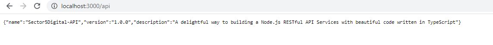
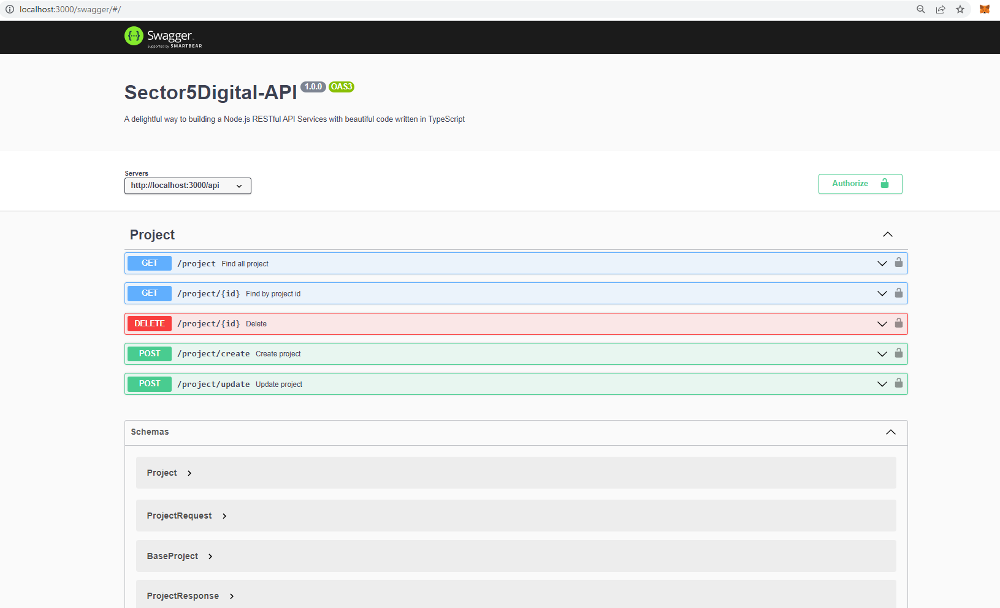

# ❯ Sector5Digital


## ❯ Getting Started

### Step 1: Set up the Development Environment

You need to set up your development environment before you can do anything.

Install [Node.js and NPM](https://nodejs.org/en/download/)

- on OSX use [homebrew](http://brew.sh) `brew install node`
- on Windows use [chocolatey](https://chocolatey.org/) `choco install nodejs`

Install yarn globally

```bash
yarn global add yarn
```

Install a MySQL database.

> If you work with a mac, we recommend to use homebrew for the installation.

Create the new database `my_database` for testing.

### Step 2: Create new Project

Fork or download this project. Configure your package.json for your new project.

Then copy the `.env.example` file and rename it to `.env`. In this file you have to add your database connection information.

Create a new database with the name you have in your `.env`-file.

Then setup your application environment.

```bash
yarn run setup
```

> This installs all dependencies with yarn. After that it migrates the database and seeds some test data into it. So after that your development environment is ready to use.

### Step 3: Serve your App

Go to the project dir and start your app with this yarn script.

```bash
yarn start serve
```

> This starts a local server using `nodemon`, which will watch for any file changes and will restart the server according to these changes.
> The server address will be displayed to you as `http://0.0.0.0:3000`.




## ❯ Scripts and Tasks

All script are defined in the `package-scripts.js` file, but the most important ones are listed here.

### Install

- Install all dependencies with `yarn install`

### Linting

- Run code quality analysis using `yarn start lint`. This runs tslint.
- There is also a vscode task for this called `lint`.

### Running in dev mode

- Run `yarn start serve` to start nodemon with ts-node, to serve the app.
- The server address will be displayed to you as `http://0.0.0.0:3000`

### Building the project and run it

- Run `yarn start build` to generated all JavaScript files from the TypeScript sources (There is also a vscode task for this called `build`).
- To start the builded app located in `dist` use `yarn start`.

## ❯ API Routes

The route prefix is `/api` by default, but you can change this in the .env file.
The swagger and the monitor route can be altered in the `.env` file.

| Route          | Description |
| -------------- | ----------- |
| **/api**       | Shows us the name, description and the version of the package.json |
| **/swagger**   | This is the Swagger UI with our API documentation |
| **/monitor**   | Shows a small monitor page for the server |
| **/api/project**  | Project entity endpoint |

## ❯ Project Structure

| Name                              | Description |
| --------------------------------- | ----------- |
| **.vscode/**                      | VSCode tasks, launch configuration and some other settings |
| **dist/**                         | Compiled source files will be placed here |
| **src/**                          | Source files |
| **src/api/controllers/**          | REST API Controllers |
| **src/api/controllers/requests**  | Request classes with validation rules if the body is not equal with a model |
| **src/api/controllers/responses** | Response classes or interfaces to type json response bodies  |
| **src/api/errors/**               | Custom HttpErrors like 404 NotFound |
| **src/api/interceptors/**         | Interceptors are used to change or replace the data returned to the client. |
| **src/api/middlewares/**          | Express Middlewares like helmet security features |
| **src/api/models/**               | TypeORM Models |
| **src/api/repositories/**         | Repository / DB layer |
| **src/api/services/**             | Service layer |
| **src/decorators/**               | Custom decorators like @Logger & @EventDispatch |
| **src/loaders/**                  | Loader is a place where you can configure your app |
| **src/public/**                   | Static assets (fonts, css, js, img). |
| **src/types/** *.d.ts             | Custom type definitions and files that aren't on

## ❯ Swagger
```
Username: admin
Password: 1234
```

## > Monitoring
```
Username: admin
Password: 1234
```